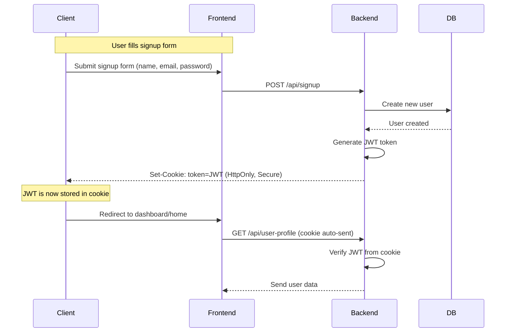
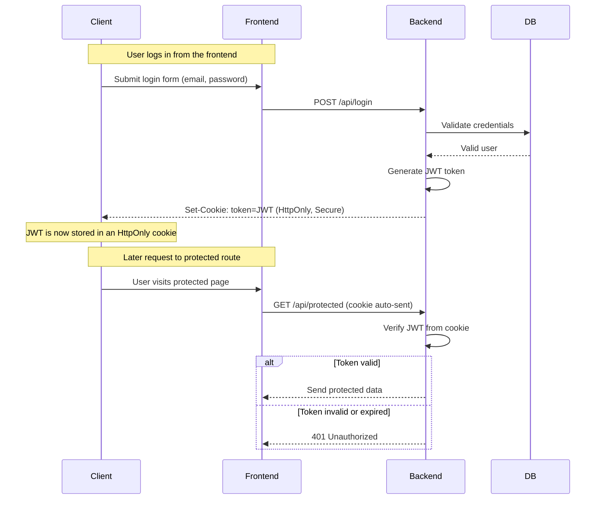
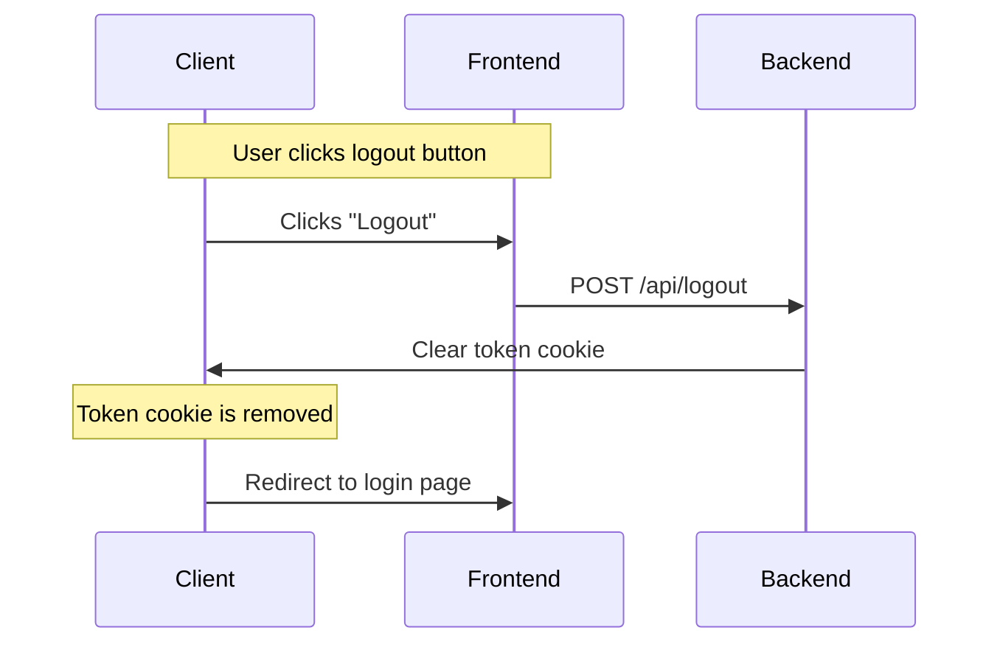

# Travel-journal-AI-powered

# signup

```mermaid
sequenceDiagram

    Note over Client, Frontend: User fills signup form
    Client->>Frontend: Submit signup form (name, email, password)
    Frontend->>Backend: POST /api/signup

    Backend->>DB: Create new user
    DB-->>Backend: User created

    Backend->>Backend: Generate JWT token
    Backend-->>Client: Set-Cookie: token=JWT (HttpOnly, Secure)

    Note over Client: JWT is now stored in cookie

    Client->>Frontend: Redirect to dashboard/home
    Frontend->>Backend: GET /api/user-profile (cookie auto-sent)
    Backend->>Backend: Verify JWT from cookie
    Backend-->>Frontend: Send user data
```

# login

```mermaid
sequenceDiagram
    Note over Client, Frontend: User logs in from the frontend
    Client->>Frontend: Submit login form (email, password)
    Frontend->>Backend: POST /api/login

    Backend->>DB: Validate credentials
    DB-->>Backend: Valid user

    Backend->>Backend: Generate JWT token
    Backend-->>Client: Set-Cookie: token=JWT (HttpOnly, Secure)

    Note over Client: JWT is now stored in an HttpOnly cookie

    Note over Client, Frontend: Later request to protected route
    Client->>Frontend: User visits protected page
    Frontend->>Backend: GET /api/protected (cookie auto-sent)

    Backend->>Backend: Verify JWT from cookie
    alt Token valid
        Backend-->>Frontend: Send protected data
    else Token invalid or expired
        Backend-->>Frontend: 401 Unauthorized
    end
```

# logout

```mermaid
sequenceDiagram

    Note over Client, Frontend: User clicks logout button
    Client->>Frontend: Clicks "Logout"
    Frontend->>Backend: POST /api/logout

    Backend->>Client: Clear token cookie

    Note over Client: Token cookie is removed
    Client->>Frontend: Redirect to login page

```
